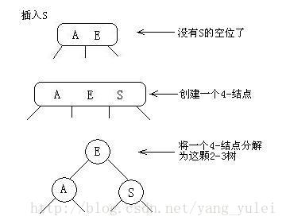
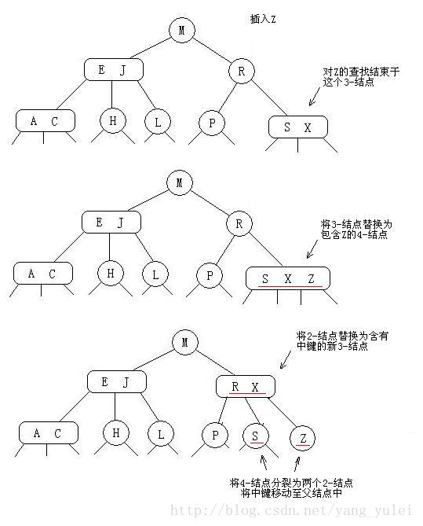

### 二分查找

我们使用有序数组存储键，经典的二分查找能够根据数组的索引大大减少每次查找所需的比较次数。
在查找时，我们先将被查找的键和子数组的中间键比较。如果被查找的键小于中间键，我们就在左子数组中继续查找，如果大于我们就在右子数组中继续查找，否则中间键就是我们要找的键。

### 二叉查找树

一颗二叉查找树（BST）是一颗二叉树，其中每个节点都含有一个可比较的键（以及相关联的值）且每个结点的键都大于其左子树中的任意结点的键而小于右子树的任意结点的键。
如果我们将一颗二叉查找树的所有键投影到一条直线上，保证一个结点的左子树中的键出现在它的右边，右子树中的键出现在它的右边，那么我们一定可以得到一条有序的键列。

### 2-3查找树

为了保证查找树的平衡性，我们需要一些灵活性，因此在这里我们允许树中的一个结点保存多个键。
2-结点：含有一个键(及值)和两条链接，左链接指向的2-3树中的键都小于该结点，右链接指向的2-3树中的键都大于该结点。
3-结点：含有两个键(及值)和三条链接，左链接指向的2-3树中的键都小于该结点，中链接指向的2-3树中的键都位于该结点的两个键之间，右链接指向的2-3树中的键都大于该结点。
#### 插入
* 向一个３-节点插入新建Ｓ

1. 构造为４-节点
2. 将４- 节点拆分为３个２-节点

     

* 向父节点为２-节点的３-节点插入新建Z

1. 构造为４-节点
2. 将４-节点中键放入父节点

     

* 向一个
